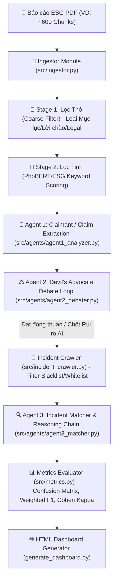

# HƯỚNG DẪN CHI TIẾT CẤU TRÚC VÀ GIẢI THÍCH MÃ NGUỒN (SOURCE CODE EXPLANATION)
## Hệ thống Phân tích & Phát hiện Tẩy Xanh ESG (ESG Greenwashing Detection Pipeline)

---

## 📌 1. Tổng quan Kiến trúc Hệ thống (System Architecture)

Hệ thống được thiết kế theo kiến trúc **Multi-Agent 3 Giai đoạn** kết hợp với **Quy trình Lọc Chunks 2 Bước** và **Bộ lọc Bằng chứng Thực tế (Incident Crawler)** nhằm phát hiện, kiểm chứng và đánh giá rủi ro Tẩy xanh (Greenwashing) trong các Báo cáo Phát triển Bền vững / ESG của doanh nghiệp FMCG tại Việt Nam.



---

## 📁 2. Cấu trúc Thư mục và Các Tệp Mã Nguồn (Directory & Module Breakdown)

```text
d:\ESG\
├── src/
│   ├── __init__.py
│   ├── config.py                  # Cấu hình tham số mô hình, API Keys, Indicators
│   ├── models.py                  # Khai báo cấu trúc dữ liệu Pydantic schemas
│   ├── ingestor.py                # Đọc PDF, làm sạch văn bản và chia đoạn (Chunking)
│   ├── phobert_embedder.py        # Quy trình Lọc Chunks 2 Giai đoạn (Coarse & Fine Filter)
│   ├── incident_crawler.py        # Cào dữ liệu báo chí thực tế (Blacklist/Whitelist/Deep-link)
│   ├── llm_client.py              # Định tuyến gọi LLM (LM Studio, OpenAI, Gemini)
│   ├── metrics.py                 # Tính toán chỉ số Confusion Matrix, Weighted F1, Cohen's Kappa
│   └── agents/
│       ├── __init__.py
│       ├── agent1_analyzer.py     # Agent 1: Trích xuất Tuyên bố & Đánh giá sơ bộ
│       ├── agent2_debater.py      # Agent 2: Vòng lặp Phản biện độc lập (Devil's Advocate)
│       └── agent3_matcher.py      # Agent 3: Đối chiếu Bằng chứng & Chuỗi suy luận (Reasoning Chain)
├── generate_dashboard.py          # Sinh Giao diện Web Dashboard HTML tương tác
├── main.py                        # Entry point phân tích đơn lẻ 1 file PDF
├── batch_run.py                   # Entry point phân tích Batch tự động toàn bộ folder data/
├── ablation_study.py              # Kịch bản thực nghiệm Ablation Study (Baseline 1 vs 2 vs 3)
└── data/                          # Thư mục chứa các file PDF báo cáo ESG đầu vào
```

---

## 🔍 3. Chi tiết Chức năng từng Tệp Mã nguồn (Detailed Code Modules)

### 3.1 [`src/config.py`](file:///d:/ESG/src/config.py)
* **Chức năng**: Quản lý toàn bộ cấu hình hệ thống, biến môi trường `.env`, tham số LLM và định nghĩa 4 nhóm **Greenwashing Indicators**:
  1. `Selective Disclosure` (Giấu thông tin xấu)
  2. `Hollow Promise` (Cam kết rỗng)
  3. `Misconduct` (Sai phạm số liệu)
  4. `Misleading Presentation` (Sử dụng ngôn ngữ mập mờ)
* **Cấu hình Đa mô hình (Multi-Model Routing)**:
  ```python
  AGENT1_MODEL_NAME = os.getenv("AGENT1_MODEL_NAME", "qwen2.5-7b-instruct")
  AGENT2_MODEL_NAME = os.getenv("AGENT2_MODEL_NAME", "llama-3.1-8b-instruct")
  AGENT3_MODEL_NAME = os.getenv("AGENT3_MODEL_NAME", "deepseek-r1-distill-qwen-7b")
  ```

---

### 3.2 [`src/models.py`](file:///d:/ESG/src/models.py)
* **Chức năng**: Định nghĩa các Schema chuẩn hóa sử dụng Pydantic v2:
  * `DocumentChunk`: Đại diện cho 1 đoạn văn bản từ PDF (trang, nội dung, điểm liên quan).
  * `GreenwashingClaim`: Tuyên bố môi trường trích xuất từ Agent 1.
  * `DebateTurn` & `ClaimDebateResult`: Lưu trữ lịch sử từng lượt tranh luận giữa Agent 1 & Agent 2, cờ `human_review_required` và `disagreement_note`.
  * `NewsIncident`: Metadata bài báo cào từ web (Tiêu đề, URL, Nguồn, Snippet).
  * `IncidentMatchResult`: Kết quả đối chiếu Agent 3, mức độ tương thích `evidence_compatibility`, chuỗi suy luận `reasoning_chain`.
  * `SystemEvaluationMetrics`: Lưu trữ ma trận nhầm lẫn (TP, FP, TN, FN), Precision, Recall, F1-Score, Accuracy và Cohen's Kappa Coefficient ($\kappa$).

---

### 3.3 [`src/ingestor.py`](file:///d:/ESG/src/ingestor.py)
* **Chức năng**: Đọc tệp PDF sử dụng `PyMuPDF (fitz)`:
  1. Trích xuất văn bản từng trang.
  2. Làm sạch nhiễu định dạng, ký tự đặc biệt, ngắt dòng thừa bằng regex `clean_vietnamese_text`.
  3. Cắt văn bản thành các đoạn `DocumentChunk` kích thước ~1000 ký tự với độ đè (overlap) 150 ký tự để không làm đứt đoạn câu văn.

---

### 3.4 [`src/phobert_embedder.py`](file:///d:/ESG/src/phobert_embedder.py)
* **Chức năng**: Thực hiện **Quy trình Lọc Chunks 2 Giai đoạn**:
  * **Stage 1 (`coarse_filter_chunks`)**: Nhận diện và loại bỏ các đoạn văn bản thuộc dạng nhiễu (Mục lục, Lời chào Chủ tịch / Tổng giám đốc, Điều khoản pháp lý, Miễn trừ trách nhiệm, Số trang).
  * **Stage 2 (`fine_filter_chunks`)**: Sử dụng bộ phân tích từ vựng tiếng Việt `pyvi` và ma trận trọng số từ khóa ESG (khí thải, Net Zero, chất thải, nước thải, ISO 14001...) để tính điểm liên quan `relevance_score`, trích chọn Top 20-30 Chunks chất lượng nhất cho Pipeline.

---

### 3.5 [`src/llm_client.py`](file:///d:/ESG/src/llm_client.py)
* **Chức năng**: Lớp giao tiếp trung gian với LLM:
  * Hỗ trợ **LM Studio Local Server** (`http://localhost:1234/v1`), OpenAI API, và Google Gemini API.
  * **Bộ bảo vệ Context Size (`Safety Context Truncation`)**: Tự động cắt tỉa văn bản nếu Prompt vượt quá 3,000 ký tự để không bao giờ bị dính lỗi `400 Context Size Exceeded` trên LM Studio.
  * `call_llm_json`: Ép xuất cấu trúc JSON chuẩn và tự động sửa lỗi cú pháp JSON bằng Regex.

---

### 3.6 [`src/agents/agent1_analyzer.py`](file:///d:/ESG/src/agents/agent1_analyzer.py)
* **Chức năng**: Agent 1 (ESG Claim Analyzer) đóng vai người truy vấn rủi ro:
  * Phân tích văn bản chunk được cấp và xác định xem có chứa tuyên bố có dấu hiệu Greenwashing hay không.
  * Đánh giá mức độ rủi ro ban đầu (`initial_risk_level`: High, Medium, Low, None) và trích dẫn câu bằng chứng gốc (`evidence_quote`).

---

### 3.7 [`src/agents/agent2_debater.py`](file:///d:/ESG/src/agents/agent2_debater.py)
* **Chức năng**: Agent 2 (Devil's Advocate) đóng vai Luật sư phản biện:
  * Soi xét đánh giá của Agent 1 xem có bị thổi phồng rủi ro hay ảo giác không.
  * Tiến hành vòng lặp tranh luận `run_debate_loop` tối đa `MAX_DEBATE_ROUNDS = 3`.
  * Nếu sau 3 vòng không đạt được đồng thuận, tự động bật cờ **`human_review_required = True`** để yêu cầu con người can thiệp.

---

### 3.8 [`src/incident_crawler.py`](file:///d:/ESG/src/incident_crawler.py)
* **Chức năng**: Thu thập thông tin kiểm chứng thực tế từ Google Search / Báo chí:
  * Áp dụng **Bộ lọc Tên miền Blacklist** (chặn Studocu, Scribd, Wikipedia, Slideshare, diễn đàn tự do) và **Whitelist** (ưu tiên báo chí chính thống Tuổi Trẻ, Thanh Niên, VNExpress, Báo Chính Phủ...).
  * Loại bỏ các URL rác chỉ trỏ về trang chủ root không chứa nội dung chi tiết.
  * Tạo đường dẫn tra cứu Google động (`https://www.google.com/search?q=...`) chống die link.

---

### 3.9 [`src/agents/agent3_matcher.py`](file:///d:/ESG/src/agents/agent3_matcher.py)
* **Chức năng**: Agent 3 (Incident Matcher & Grounding):
  * Áp dụng nguyên tắc phi tuyệt đối: *Absence of Violation Record != Absence of Risk*.
  * Đánh giá theo Thang **Mức độ tương thích bằng chứng (`evidence_compatibility`)**: `HIGHLY_COMPATIBLE`, `PARTIALLY_COMPATIBLE`, `REFUTED`, `NO_EVIDENCE`.
  * Trích xuất **Chuỗi suy luận từng bước (`reasoning_chain`)** trước khi đưa ra nhãn kết luận.
  * Ràng buộc trích dẫn URL chính xác 100% từ danh sách metadata.

---

### 3.10 [`src/metrics.py`](file:///d:/ESG/src/metrics.py)
* **Chức năng**: Tính toán toàn bộ chỉ số định lượng:
  * Tính Confusion Matrix: `TP`, `FP`, `TN`, `FN`.
  * Tính **Weighted Precision, Recall, F1-Score, Accuracy** giải quyết bài toán imbalanced data cho các báo cáo doanh nghiệp sạch.
  * Tính chỉ số đồng thuận **Cohen's Kappa Coefficient ($\kappa$)** cho Vòng 1 và Vòng cuối.

---

### 3.11 [`generate_dashboard.py`](file:///d:/ESG/generate_dashboard.py)
* **Chức năng**: Sinh file Web Dashboard HTML tương tác (`dashboard.html` / `output_results.html`):
  * **Dashboard 1**: Tổng hợp rủi ro, biểu đồ phân bổ Chart.js.
  * **Dashboard 2**: Thẻ chi tiết tuyên bố, lịch sử tranh luận Agent 1 vs Agent 2, cờ cảnh báo HITL, chuỗi suy luận Agent 3 và bộ lọc chọn doanh nghiệp (Company Filter Dropdown).
  * **Dashboard 3**: Bảng điểm từng doanh nghiệp, Bảng điểm trung bình toàn bộ Dataset, Bảng so sánh **Section 4.4 Ablation Study** và chỉ số Cohen's Kappa.

---

### 3.12 [`batch_run.py`](file:///d:/ESG/batch_run.py) & [`ablation_study.py`](file:///d:/ESG/ablation_study.py)
* **`batch_run.py`**: Tự động quét tất cả tệp PDF trong `data/`, phân tích song song đa doanh nghiệp và xuất file tổng hợp `batch_summary.json`.
* **`ablation_study.py`**: Chạy kịch bản so sánh 3 cấu hình (Baseline 1: Single Agent -> Baseline 2: 2 Agents Debate -> Proposed Pipeline: Full 3 Agents) để chứng minh hiệu quả đóng góp của từng Agent.

---

## 🔄 4. Luồng xử lý Dữ liệu (Data Flow Sequence)

```text
[File PDF Báo cáo]
       │
       ▼
[src/ingestor.py] ──> Chunks thô (~600 Chunks)
       │
       ▼
[src/phobert_embedder.py]
  ├── Stage 1: Coarse Filter (Loại rác, Mục lục, Disclaimer) ──> ~500 Chunks sạch
  └── Stage 2: Fine Filter (PhoBERT ESG Scoring) ──> Top 20 Candidate Chunks
       │
       ▼
[src/agents/agent1_analyzer.py] ──> Phát hiện Claim & Risk Level ban đầu
       │
       ▼
[src/agents/agent2_debater.py] ──> Vòng lặp phản biện 3 lượt (Agent 1 vs Agent 2)
       │                         └── Tự động bật cờ HITL nếu chưa đồng thuận
       ▼
[src/incident_crawler.py] ──> Cào báo chí (Lọc Blacklist/Whitelist/Deep-link)
       │
       ▼
[src/agents/agent3_matcher.py] ──> Đối chiếu Bằng chứng, Reasoning Chain, Evidence Compatibility
       │
       ▼
[src/metrics.py] ──> Tính Weighted F1, Confusion Matrix, Cohen's Kappa
       │
       ▼
[generate_dashboard.py] ──> Xuất Giao diện Web Dashboard HTML đa doanh nghiệp
```
